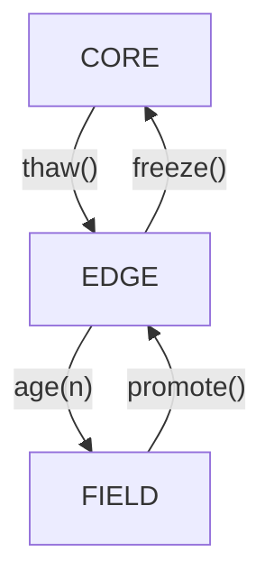

# Human API Protocol (HAP) — Draft v0.1

*Status  : **Draft for community feedback**
License  : Apache 2.0 (intended)
Date     : 2025‑06‑29*

---

## 1  Motivation

Today’s web optimises for engagement metrics rather than human flourishing. **Human API** is a minimal, open protocol that pairs each person with a co‑adaptive AI and lets those pairs interlink into a mesh that automatically routes help where it is most effective. Core design goal: *humans retain unilateral control over what must stay stable while AIs optimise everything else.*

---

## 2  Glossary

| Term              | Meaning                                               |
| ----------------- | ----------------------------------------------------- |
| **Human**         | A natural person; originator of "stable" commitments. |
| **Co‑Pilot (AI)** | Autonomous model acting on behalf of a single human.  |
| **Pair**          | `{human_id, ai_id}` plus shared storage.              |
| **Node**          | Implementation instance exposing HAP over HTTPS/gRPC. |
| **Mesh**          | Set of nodes exchanging capability + need adverts.    |
| **Object**        | JSON/BSON record managed by mutability policy.        |
| **Mutability**    | `CORE`, `EDGE`, `FIELD` (see §4).                     |

---

## 3  High‑Level Architecture

```
┌───────────────┐          mesh gossip / relay         ┌───────────────┐
│   Pair A      │  ←─────────────►─────────────→       │   Pair B      │
│ (human + AI)  │                                     │ (human + AI)  │
└───────────────┘                                     └───────────────┘
        ▲   ▲                                            ▲   ▲
        │   └─ Divergence events (webhook)                │   └─ needs/strengths
        │                                                │
CORE / EDGE / FIELD object stores                CORE / EDGE / FIELD object stores
```

---

## 4  Mutability Model

| Enum    | Write authority                   | Examples                                  |
| ------- | --------------------------------- | ----------------------------------------- |
| `CORE`  | **Human‑signed only**             | Value set, privacy rules, non‑negotiables |
| `EDGE`  | *AI proposes → Human veto (48 h)* | Habit models, trust weights               |
| `FIELD` | **AI autonomous**                 | Embedding indexes, caches                 |

Objects carry a `"mut"` field. Transition rules:



### 4.1 Capability Tokens

Mutations across zones require a JWT whose `mut_scope` claim equals the *target* zone.

```json
{
  "sub": "human:alice",
  "iat": 1719660000,
  "mut_scope": "CORE",
  "exp": 1719746400
}
```

Nodes **must** reject zone transitions without a valid token.

---

## 5  HTTP + gRPC Surface

> Base path prefix: `/.well-known/hap/v0/`
> All JSON uses canonical UTF‑8; gRPC service descriptors are in `proto/hap.proto`.

### 5.1 Stable‑Core Endpoints

| Verb | Path           | Description                                 |
| ---- | -------------- | ------------------------------------------- |
| GET  | `/core`        | List CORE objects (names + hashes).         |
| PUT  | `/core/{key}`  | Create / update item (requires CORE token). |
| POST | `/core/freeze` | Batch‑promote EDGE→CORE.                    |

### 5.2 Adaptable‑Edge Endpoints

| Verb | Path                       | Description                               |           |
| ---- | -------------------------- | ----------------------------------------- | --------- |
| POST | `/edge/proposal`           | AI submits delta → returns `proposal_id`. |           |
| POST | `/edge/vote/{proposal_id}` | Human \`approve                           | reject\`. |

### 5.3 Field Endpoints

| Verb | Path            | Description                             |
| ---- | --------------- | --------------------------------------- |
| POST | `/field/mutate` | AI mutates FIELD items (no extra auth). |

### 5.4 Events

| Channel                    | Payload                               |
| -------------------------- | ------------------------------------- |
| `POST /events/divergence`  | `{human_vec, ai_vec, jsd, timestamp}` |
| `POST /events/mesh-advert` | `{strengths[], needs[], sig}`         |

---

## 6  Divergence Calculation

Implementation RECOMMENDED to import reference algo from [`divergence_sync.py`](../utils/divergence_sync.py). Default threshold: `jsd > 0.15`. When exceeded, node MUST emit the divergence event **and** pause autonomous mutations until resolved.

---

## 7  Mesh Coupling

1. **Advert** – Node A POSTs `mesh-advert` to a gateway.
2. **Matching** – Gateway computes semantic overlap, returns candidate node URLs.
3. **Handshake** – Nodes establish mTLS channel; exchange *capability tokens* with limited scopes.

> *Privacy note:* Core hashes allow compatibility checks without revealing contents.

---

## 8  Security & Privacy

* All endpoints served over HTTPS with HSTS.
* JWTs signed by Ed25519 keys stored in client hardware enclave or DID wallet.
* Nodes keep append‑only Merkle log of zone transitions; humans can audit or roll back.
* Gateway may not store CORE data—only cryptographic commitments.

---

## 9  Reference Implementation Plan

| Milestone | Deliverable                                             |
| --------- | ------------------------------------------------------- |
| M1        | Rust + Python SDKs for tokens + mutability filter       |
| M2        | Example Node (FastAPI) with divergence monitor wired in |
| M3        | Mesh Gateway PoC (matching + relay)                     |
| M4        | Electron “Core Vault” desktop UI                        |
| M5        | Public Testnet + Governance RFC                         |

---

## 10  Governance

Initial spec stewarded by the *Internet 2.0 Co‑Lab* on GitHub. After M3 the project moves to a community RFC model (adapted from Rust RFCs). Versioning follows SemVer; breaking changes bump MAJOR.

---

## 11  Contributing

PRs welcome! Please file an issue to discuss large changes before submitting code. All contributions released under Apache 2.0.
